import { Callout } from "@/components/markdown"

> [!caution] 注意事項
> この記事は自分用の備忘録として書いたものです。
> 私自身Docker初心者なので、多分に間違いを含んでいる可能性があります。
> 誤りを見つけた方は、[GitHub Issue](https://github.com/r4ai/r4ai.dev/issues) にてご指摘いただけると大変ありがたいです。

## 主要概念



- **Container**：

  - Image を元に作成されるプログラムの実行環境
    - Image が実行状態となったインスタンスのこと
    - Image と Container の関係性は、クラスとインスタンスの関係性に似ている
  - 各 Container は、それぞれ独立している
    - 例えば、ある Container にインストールされたアプリケーションは、他の Container には影響を与えない
  - Container はポータブルであり、どのOSでも実行可能

- **Image**：

  - Container を作成するための設計図
  - Container を構成する全ての要素と、その他メタデータを含む
    - これら要素やメタデータはそれぞれ **Layer** と呼ばれ、Dockerfile の各命令に対応する

- **Dockerfile**：
  - Dockerfile は、Image を作成するための設定ファイル。
  - Dockerfile の個々の命令（e.g. `RUN ...`, `COPY ...`）が、それぞれ Image の Layer となる。
  - Dockerfile の書き換えによって Image を再構築する際は、変更された Layer のみ再構築される。



1. **Dockerfile** (設定ファイル) から **Image** (設計図) を作る

   ```sh
   $ docker image build <path-to-dockerfile>
   ```

2. **Image** (設計図) から **Container** (実体) を作る

   ```sh
   $ docker container create <image-name>
   ```

3. **Container** (実体) でやりたいことを実行する

   ```sh
   $ docker container exec <command>
   ```

<Callout type="note" title="コラム: Container とは何なのか">
  Containerとは、ホストマシン上で直接実行される隔離されたプロセスの集まりである。
  この隔離はOSカーネルの仕事であり、 [kernel namespace と cgroups](https://medium.com/@saschagrunert/demystifying-containers-part-i-kernel-space-2c53d6979504) が利用されている。

  Container はVMのようにOSの上でOSを実行するわけではないため、オーバーヘッドが少なく軽量である。さらに、通常のプロセスと同じくらい高速に起動できる。
  しかし、Containerはカーネルが作り出している環境でOSは一つなので、異なるOSのシステム、プログラム等は動かせない。

  > [技術評論社 | コンテナの仕組みとLinuxカーネルのコンテナ機能［1］名前空間とは？](https://gihyo.jp/admin/serial/01/linux_containers/0002)
</Callout>

### 参考文献

https://docs.docker.jp/get-started/overview.html

https://docs.docker.com/get-started/

https://zenn.dev/suzuki_hoge/books/2022-03-docker-practice-8ae36c33424b59/viewer/2-1-points

## Container 基本操作

| コマンド                                   | 説明                                       |
| ------------------------------------------ | ------------------------------------------ |
| `run`                                      | コンテナを起動。実行終了時にコンテナを停止 |
| `run --rm`                                 | コンテナを起動。実行終了時にコンテナを削除 |
| `run -it`                                  | コンテナを対話環境で起動                   |
| `run -d`, `run --detach`                   | コンテナをバックグラウンドで起動           |
| `run --name <名前>`                        | コンテナに名前をつけて起動                 |
| `run --publish <host-machine>:<container>` | コンテナのポートをホストマシンに公開       |

<Callout type="example" title="例）">
  nginx のコンテナを、バックグラウンドで起動し、ホストマシンの 8080 番ポートに公開し、終了時にコンテナを削除する場合の例：

  ```sh
  $ docker container run \       # コンテナを起動するよ
           --name web-server \   # 名前はweb-serverにするよ
           --rm \                # 終了時にコンテナを削除してね
           --detach \            # バックグラウンドで起動するよ
           --publish 8080:80 \   # contaierの80番ポートをhostの8080番ポートに公開するよ
           nginx:latest          # nginxのlatestイメージを使うよ
  ```
</Callout>

その他操作：

| コマンド     | 説明                                             |
| ------------ | ------------------------------------------------ |
| `ls`         | 起動中のコンテナを表示                           |
| `ls --all`   | 全て（停止中・起動中）のコンテナを表示           |
| `stop`       | コンテナを停止                                   |
| `rm`         | 停止中のコンテナを削除                           |
| `rm --force` | 起動中のコンテナを削除                           |
| `exec`       | 起動中のコンテナに対してコマンドを実行           |
| `exec -it`   | 起動中のコンテナに対して対話環境でコマンドを実行 |

<Callout type="example" title="例）">
  `web-server` という名前の起動中のコンテナに対して、`echo 'Hello, World!'` というコマンドを bash で実行する場合の例：

  ```sh
  $ docker container exec web-server \
           bash -c "echo 'Hello, World!'"
  ```
</Callout>

簡単のため、一部コマンドのみを記載している。詳しくは、[コマンドラインリファレンス](https://docs.docker.com/engine/reference/commandline/container_run/)を参照されたい。

### 参考文献

https://docs.docker.com/engine/reference/commandline/container_run/

https://docs.docker.jp/engine/reference/commandline/container_toc.html

## Image 基本操作

| コマンド                            | 説明                                                                                         |
| ----------------------------------- | -------------------------------------------------------------------------------------------- |
| `build <path>`                      | `./Dockerfile`からイメージをビルドする。`<path>`は、`COPY`でファイルを指定するときの相対パス |
| `build --file <path-to-dockerfile>` | Dockerfileのパスを指定して、イメージをビルドする。                                           |
| `build --tag <tag>`                 | タグ付けしてイメージをビルドする                                                             |

<Callout type="example" title="例）">
  `./Dockerfile`から、`my-ubuntu:v2` というタグをつけてイメージをビルドする場合の例：

  ```sh
  $ docker image build \
           --tag my-ubuntu:v2 \
           .
  ```
</Callout>

その他操作：

| コマンド          | 説明                             |
| ----------------- | -------------------------------- |
| `history <image>` | イメージのレイヤー情報を確認する |

簡単のため、一部コマンドのみを記載している。詳しくは、[コマンドラインリファレンス](https://docs.docker.com/engine/reference/commandline/image_build/)を参照されたい。

### 参考文献

https://docs.docker.com/engine/reference/commandline/image_build/

https://docs.docker.jp/engine/reference/commandline/image_toc.html

## Dockerfile

| 命令                          | 説明                                                             |
| ----------------------------- | ---------------------------------------------------------------- |
| `FROM <image>`                | ベースとなるイメージを指定する                                   |
| `RUN <cmd>`                   | コマンドを実行する                                               |
| `COPY <path>`                 | ホストマシンのファイルを Image にコピーする                      |
| `CMD`                         | コンテナ起動時に実行するコマンド（デフォルト命令）を指定する     |
| `WORKDIR <dir>`               | Dockerfile内で以降に記述される命令の作業ディレクトリを指定する   |
| `ENV <key>=<value>`           | 環境変数を設定する。作成した環境変数は、Container でも維持される |
| `ARG <名前>[=<デフォルト値]>` | `docker build`時にユーザーが指定できる変数を定義する             |

<Callout type="example" title="例）">
  `ubuntu:latest` をベースとして、`./hello.sh` をコンテナ起動時に実行するイメージをビルドする場合の例：

  ```dockerfile title="Dockerfile" showLineNumbers
  # ベースとなるImageを指定する
  FROM ubuntu:latest

  # 以降の命令は、このディレクトリを作業ディレクトリとして実行される
  WORKDIR /app

  # 依存関係を更新し、curl をインストールする
  RUN apt-get update && apt-get install -y \
      curl \
      && rm -rf /var/lib/apt/lists/*

  # ホストマシンの`./hello.sh`を、Imageにコピーする
  COPY ./hello.sh .

  # コンテナ起動時に実行するコマンドを指定する
  CMD ["/hello.sh"]
  ```

  - ビルド時のキャッシュは、レイヤー毎に行われる
    e.g. 3行目で失敗した場合、1行目と2行目はキャッシュが利用される
  - 完成した Image の Layer は、ベースとなる Image の Layer に加えて、Dockerfile の各命令に対応する Layer を重ねたものとなる
</Callout>

### 参考文献

https://docs.docker.com/engine/reference/builder/

https://docs.docker.jp/engine/reference/builder.html

https://docs.docker.jp/develop/develop-images/dockerfile_best-practices.html

## ボリューム (マウント)

- **ボリューム**：
  - コンテナ内のファイルをホストマシン上でDockerが管理してくれる仕組み
  - **ホストマシン上のどこに保存されているかは関心がなく**、とにかくデータを永続化するのに使う

- ボリュームの作成：

  ```sh
  $ docker volume create <volume-name>
  ```

- ボリュームの削除：

  ```sh
  $ docker volume rm <volume-name>
  ```

- ボリュームの一覧表示：

  ```sh
  $ docker volume ls
  ```

- ボリュームをコンテナにマウントする：
  - `--volume`もしくは`--mount`オプションを使う
    - `--mount`の方が詳細に設定可能であり、可読性が高いので、こちらを推奨したい
  - それぞれのオプションの書き方は以下の通り。両者は同じ意味である
    - `--volume <ボリューム名>:<マウント先(コンテナ上のパス)>`
    - `--mount type=volume,src=<ボリューム名>,dst=<マウント先(コンテナ上のパス)>`

  <Callout type="example" title="例）">
    `my-volume` という名前のボリュームを、`/var/lib/mysql` にマウントする場合の例：

    ```sh
    # --volumeオプションを使う場合
    $ docker container run \
             --volume my-volume:/var/lib/mysql \
             my-container:db
    ```

    ```sh
    # --mountオプションを使う場合
    $ docker container run \
             --mount type=volume,src=my-volume,dst=/var/lib/mysql \
             my-container:db
    ```
  </Callout>

### 参考文献

https://docs.docker.com/storage/volumes/

https://zenn.dev/suzuki_hoge/books/2022-03-docker-practice-8ae36c33424b59/viewer/3-4-volume

## バインドマウント

- **バインドマウント**：
  - ホストマシン上の任意のディレクトリを、コンテナ上にマウントする仕組み
  - ボリュームと違い、ホストマシン上のどこに保存されるかに関心がある
  - **ホストマシンとコンテナ双方がファイルの変更に関心がある**場合に有用である
- `volume`によるバインドマウント：
  - `:`で区切られた値の一つ目を絶対パスにすると、バインドマウントとなる

  ```sh
  $ docker container run \
           --volume $(pwd)/src:/src \
           my-container:app
  ```
- `--mount`によるバインドマウント

  ```sh
  $ docker container run \
           --mount type=bind,src=$(pwd)/src,dst=/src \
           my-container:app
  ```

### 参考文献

https://docs.docker.com/storage/bind-mounts/

https://zenn.dev/suzuki_hoge/books/2022-03-docker-practice-8ae36c33424b59/viewer/3-5-bind-mount
